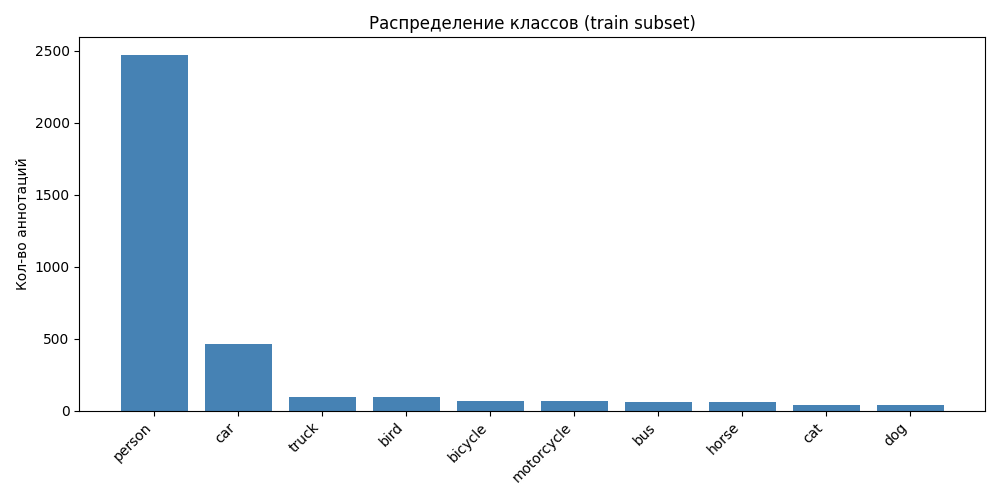
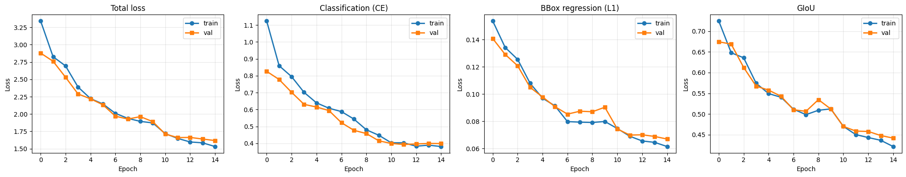
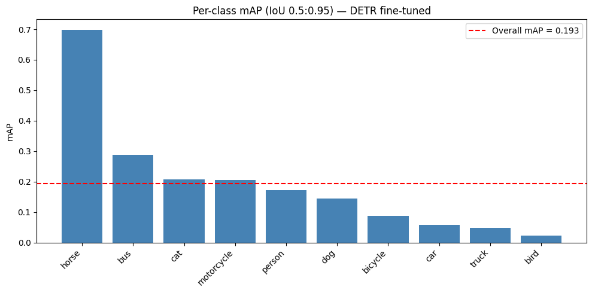
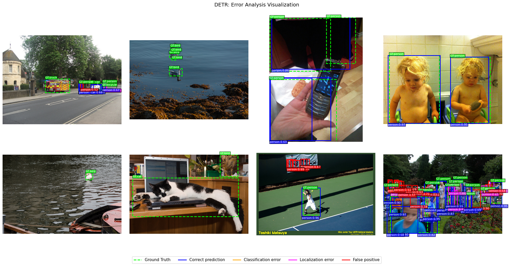
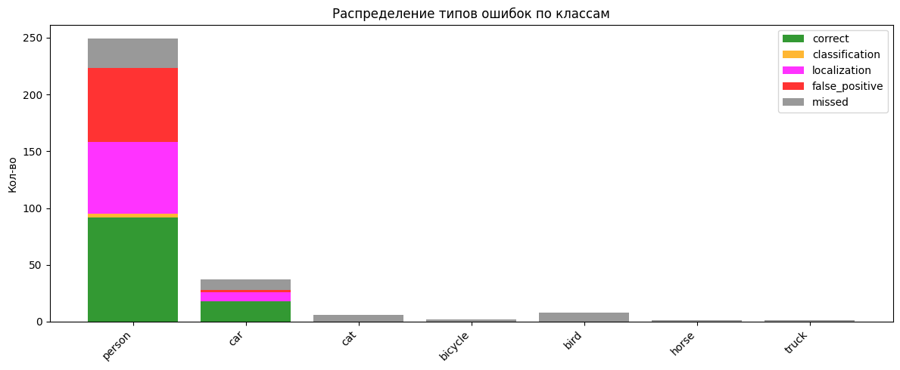
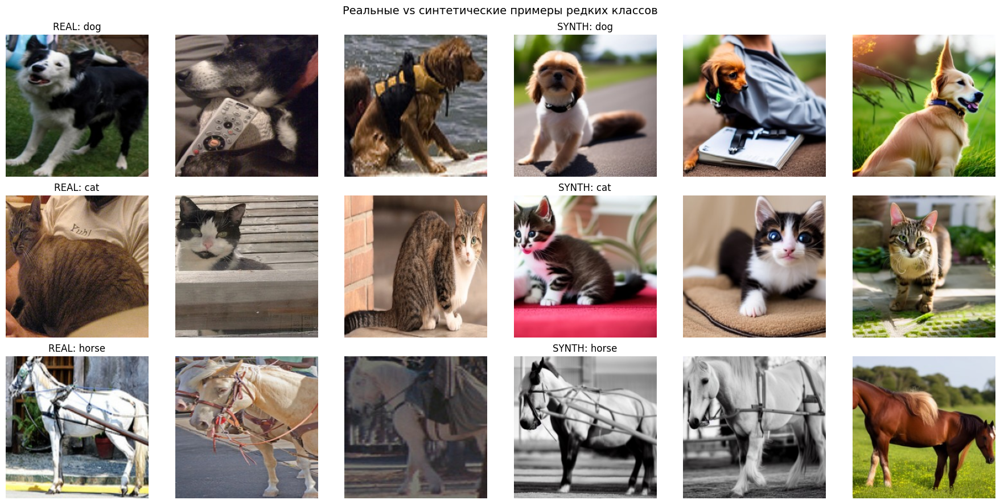
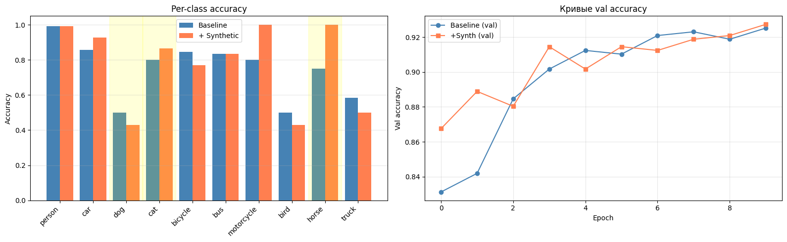

# HW3

## Стек

- **PyTorch 2.x** + **HuggingFace Transformers** (`DetrForObjectDetection`, `DetrImageProcessor`)
- **HuggingFace Diffusers** + **ControlNet** (`sd-controlnet-canny`, `stable-diffusion-v1-5`)
- **pycocotools** — COCO аннотации
- **torchmetrics** — mAP / mAP50
- **Albumentations** — аугментации с правильной трансформацией bbox
- **TensorBoard** — логирование

### 1.1 Датасет
Чтобы не качать полный COCO train (20 GB), взял **COCO val2017** (1 GB) и отфильтровал 10 классов: person, car, dog, cat, bicycle, bus, motorcycle, bird, horse, truck. Оригинальные COCO category_id переназначил в локальные индексы, сохранил в `instances_subset_train.json` и `instances_subset_val.json` в COCO-совместимом формате.

#### Распределение классов


Распределение крайне несбалансированное, person доминирует, car 470, остальные по 30–100. Это сильно влияет на качество, модель «выучивает» person и работает хуже на остальном

### 1.2 Модель и обучение

| Параметр | Значение |
|---|---|
| Базовая модель | `facebook/detr-resnet-50` (предобучена на COCO 91 кл.) |
| Поменял | `class_labels_classifier` на 10 классов|
| Optimizer | AdamW |
| LR (head/transformer) | 1e-4 |
| LR (backbone) | 1e-5 (раздельные группы параметровкак в оригинальной статье DETR) |
| Weight decay | 1e-4 |
| Scheduler | StepLR (γ=0.1 каждые 10 эпох) |
| Batch size | 4 |
| Epochs | 15 |
| Gradient clipping | 0.1 |
| Аугментации | HorizontalFlip, ColorJitter, HueSaturationValue |

Время обучения: 40 минут на T4. Модель сохранялась по лучшему val loss

### 1.3 Кривые потерь



DETR возвращает три компоненты loss отдельно:
- **Classification (CE)** кросс энтропия по классам в каждом из 100 query slots
- **BBox regression (L1)** L1 на нормированных координатах
- **GIoU** штраф за плохое перекрытие

Все три монотонно падают, train и val идут вместе переобучения нет. На эпохе 10 виден небольшой уступ после StepLR learning rate упал в 10 раз, обучение пошло мельче и стабильнее.

Стартовые значения total loss: 3.34 (train) / 2.88 (val), финальные: 1.55 / 1.62.

### 1.4 Метрики на val

| Метрика | Значение |
|---|---|
| **mAP (IoU 0.5:0.95)** | **0.1932** |
| **mAP50** | **0.3478** |
| **mAP75** | 0.1812 |
| mAP small | 0.0063 |
| mAP medium | 0.0667 |
| mAP large | 0.3610 |

1. **mAP small 0.006** DETR откровенно плохо ловит маленькие объекты
2. **mAP large >mAP small** почти вся метрика держится на крупных объектах
3. **mAP50 / mAP = 1.8**  большой разрыв означает, что модель находит объекты, но локализует их неточно

#### Per-class mAP



| Класс | mAP | Аннотаций в train |
|---|---|---|
| horse | 0.70 | 60 |
| bus | 0.29 | 60 |
| cat | 0.21 | 30 |
| motorcycle | 0.20 | 65 |
| person | 0.18 | 2470 |
| dog | 0.15 | 30 |
| bicycle | 0.09 | 70 |
| car | 0.06 | 470 |
| truck | 0.05 | 95 |
| bird | 0.02 | 95 |

Интересно, что horse (60 примеров) лучший, а person (2470 примеров) средний. Похоже, простые большие уобъекты (лошади на фоне поля) проще научиться детектировать, чем многоликих людей в десятках поз и масштабов. Также bird падает в ноль птицы мелкие и mAP small как раз около нуля

### 1.5 Error analysis

Анализирую 30 случайных val-картинок, классифицирую каждое предсказание на 4 типа:

- **Correct** IoU > 0.5 и класс верный
- **Classification error** IoU > 0.1, но класс другой
- **Localization error** класс верный, но IoU < 0.5
- **False positive** IoU < 0.1 с любым GT
- **Missed (FN)** GT объект для которого нет предсказания с IoU > 0.5





- Класс person доминирует и в ошибках, это следствие дисбаланса датасета. На правой нижней картинке теннисный матч с трибуной зрителей куча FP и localization errors.
- Classification errors нулевые, если бокс попал близко к GT, класс почти всегда угадан правильно, проблема не в категориях, а в локализации и поиске
- Localization + False positive основные две категории, для production сценария это полечится либо более долгим обучением, либо повышением score_threshold, либо переходом на Deformable-DETR с multi-scale features.
- Missed detections заметны на `bird` и мелких объектах, сходится с mAP small = 0


## Stable Diffusion + ControlNet
### 2.1 Процесс генерации
**Pipeline:**

- **Модель:** `runwayml/stable-diffusion-v1-5` + `lllyasviel/sd-controlnet-canny`
- **Sampler:** UniPC, 20 шагов
- **Guidance scale:** 7.5
- **ControlNet conditioning scale:** 0.8
- **Negative prompt:** `low quality, blurry, cartoon, painting, deformed, distorted`
- **Промпт-шаблоны** по 3 варианта на класс, ротация для разнообразия. Пример для horse:
  ```
  "a horse standing in a field, photorealistic, daytime"
  "a brown horse in a meadow, professional photography"
  "a horse with white spots, nature photo, sharp focus"
  ```

Объём генерации: 60 картинок на каждый из 3 классов = **180 синтетических картинок**. Время 20 минут на T4.

#### Реальные vs синтетические примеры



На cat норм, на dog иногда видны характерные SD-артефакты (нечёткие лапы, странная анатомия), но в целом класс распознаваем.

### 2.2 Обучение классификаторов

Базовая модель: **ResNet-18**, fc заменён на 10 классов.

| Параметр | Значение |
|---|---|
| Optimizer | AdamW |
| LR | 3e-4 |
| Scheduler | CosineAnnealingLR |
| Weight decay | 1e-4 |
| Batch size | 32 |
| Epochs | 10 |
| Аугментации | HorizontalFlip, ColorJitter |

Тренируем два раза на одной и той же val-выборке (только реальные кропы):

1. Baseline train только из real кропов
2. Synthetic train это real кропы + 180 синтетических

### 2.3 Результаты

| Class | Baseline | + Synthetic | diff | rare? |
|---|---|---|---|---|
| person | 0.991 | 0.991 | +0.000 | |
| car | 0.857 | 0.929 | +0.071 | |
| **dog** | 0.500 | 0.429 | -0.071 | yes |
| **cat** | 0.800 | 0.867 | +0.067 | yes |
| bicycle | 0.846 | 0.769 | -0.077 | |
| bus | 0.833 | 0.833 | +0.000 | |
| motorcycle | 0.800 | **1.000** | +0.200 | |
| bird | 0.500 | 0.429 | -0.071 | |
| **horse** | 0.750 | **1.000** | +0.250 | yes |
| truck | 0.583 | 0.500 | -0.083 | |
| **OVERALL** | **0.925** | **0.927** | **+0.002** | |

**Только редкие классы:**

| Setup | Mean acc на редких |
|---|---|
| Baseline | 0.683 |
| + Synthetic | **0.765** |
| **diff** | **+0.082** (+8.2 п.п.) |




- Улучшение на редких классах достигнута. Средняя accuracy на трёх редких классах выросла с 0.683 до 0.765 (+8.2 п.п.). Особенно хорошо на horse и cat 
- На dog деградация -7.1 если посмотреть на синтетику для dog в визуализации, видно, что SD генерирует странных собак, этот шум сбивает модель. Получается качество синтетики критично
- Overall accuracy почти не сдвинулась (+0.002). Это ожидаемо, редкие классы дают мало веса в общем accuracy, а сильнее всего метрику двигают person (уже 99% улучшать нечего) и car

## Выводы

### Задание 2 (DETR)
1. DETR файнтюнится из коробки на маленькой подвыборке COCO за 15 эпох все три компоненты loss стабильно падают, переобучения нет.
2. Получил mAP50 = 0.35 (на 700 train картинок и 15 эпох)
3. Слабое место это мелкие объекты (mAP small ≈ 0.006)
4. Основные ошибки это localization и false positives, classification почти не страдает. Если бокс попал класс почти всегда правильный.

### Задание 2.5 (Synthetic)
1. SD + ControlNet работает для аугментации редких классов с сохранением bbox-геометрии.
2. Эффект синтетики неоднородный по классам, где-то синтетика получается фотореалистично horse, cat, где-то SD путается в анатомии dog
3. Overall accuracy не показывает эффект, тк редкий класс это малая доля. 